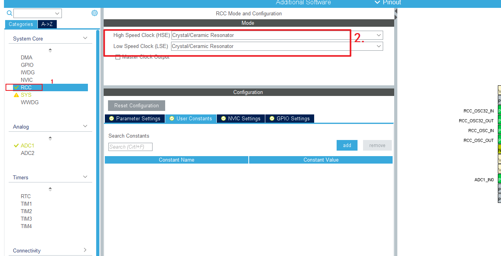
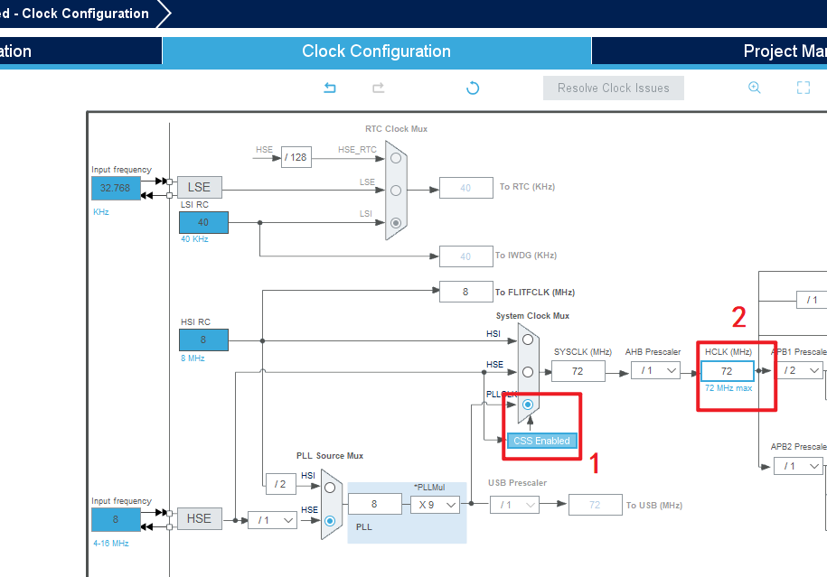
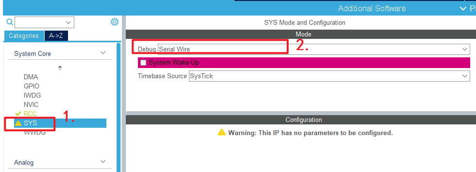
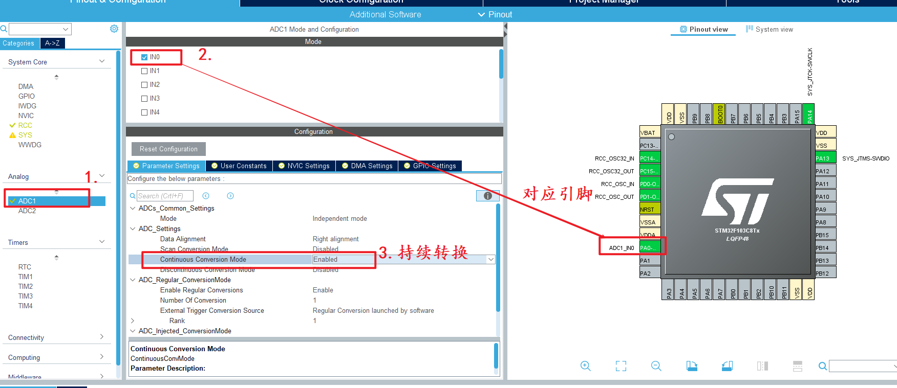
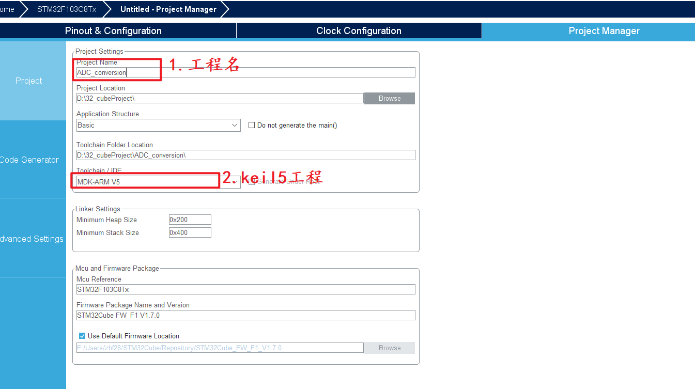
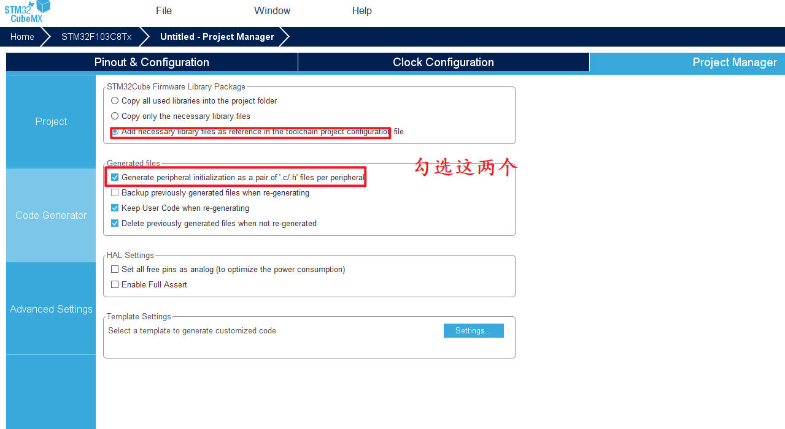
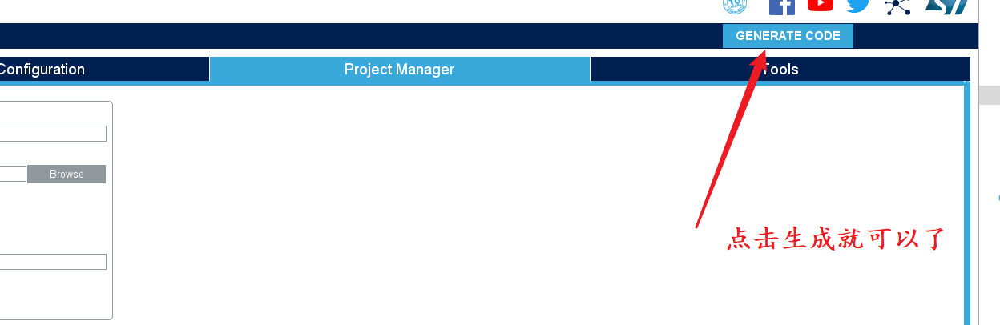
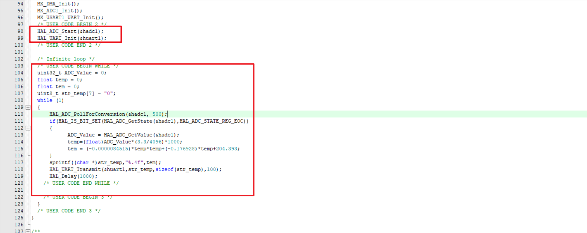
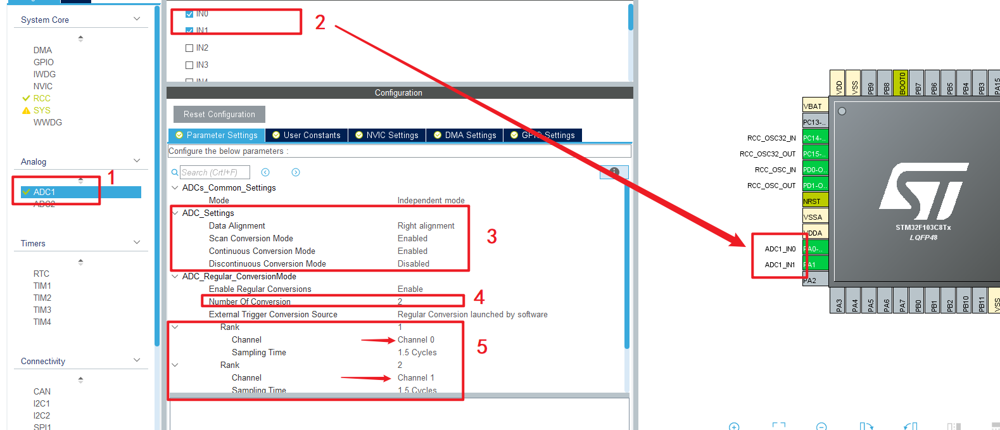
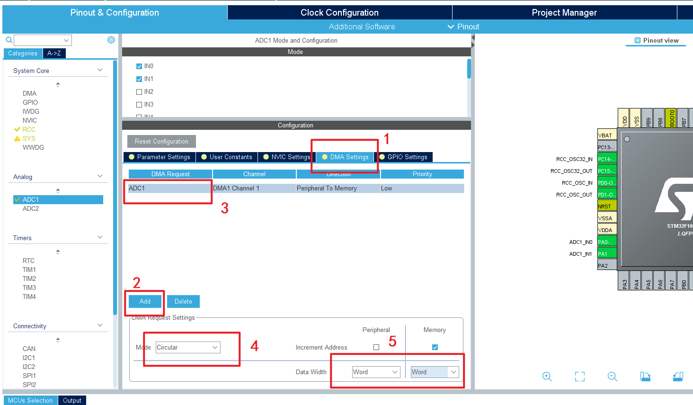

# AD_DMA 配置

## 一、时钟配置





## 二、SW下载



## 三、ADC轮询配置




**ADC轮询模式，只配置这个，别的不用配置**







> **1. 启动ADC转换函数**：HAL_ADC_Start在while(1)外部调用，初始化ADC轮询模式

```C
HAL_ADC_Start(&hadc1); // 启动ADC轮询方式
```

> **2.等待ADC转换完成：**HAL_ADC_PollForConversion(ADC_HandleTypeDef* hadc, uint32_t Timeout)

```C
uint16_t ADC_Value = 0;
HAL_ADC_PollForConversion(&hadc1, 50);
if(HAL_IS_BIT_SET(HAL_ADC_GetState(&hadc1),HAL_ADC_STATE_REG_EOC))
{
	ADC_Value = HAL_ADC_GetValue(&hadc1); //获取电压读取值
}
```

```C
/* 电赛代码 */
uint32_t ADC_Value = 0;
float temp = 0;
float tem = 0;
uint8_t str_temp[7] = "0";
while (1)
{
	  HAL_ADC_PollForConversion(&hadc1, 500);
	  if(HAL_IS_BIT_SET(HAL_ADC_GetState(&hadc1),HAL_ADC_STATE_REG_EOC))
	  {
			ADC_Value = HAL_ADC_GetValue(&hadc1);
			temp=(float)ADC_Value*(3.3/4096)*1000;
			tem = (-0.0000084515)*temp*temp+(-0.176928)*temp+204.393;
	  }
	  sprintf((char *)str_temp,"%.4f",tem);
	  HAL_UART_Transmit(&huart1,str_temp,sizeof(str_temp),100);
	  HAL_Delay(1000);
}
```



## 四、ADC的DMA配置2个采集通道





> 代码：

```C
uint32_t ADC_Value[100];
uint8_t str_temp[7] = "0";
uint8_t i = 0;
uint32_t adc_value;
float temp = 0;
float tem = 0;

HAL_ADC_Start_DMA(&hadc1,ADC_Value,100);

HAL_Delay(500);
for(i = 0;i<100;i++)
{
    adc_value += ADC_Value[i];
}
adc_value /= 100;
temp=(float)adc_value*(3.3/4096)*1000;
tem = (-0.0000084515)*temp*temp+(-0.176928)*temp+204.393;
sprintf((char *)str_temp,"%.4f",tem);
HAL_UART_Transmit(&huart1,str_temp,sizeof(str_temp),100);
```


