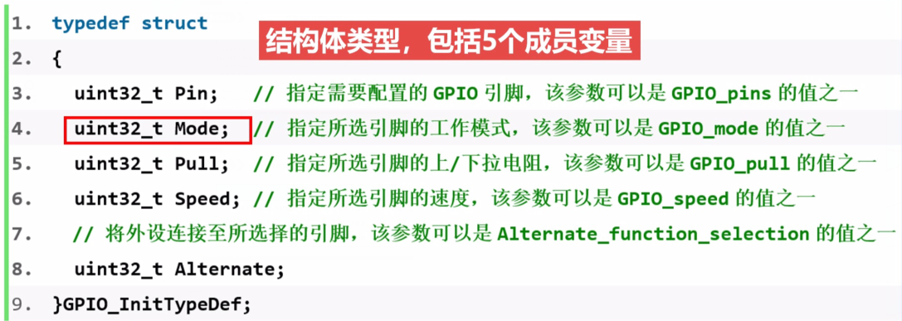
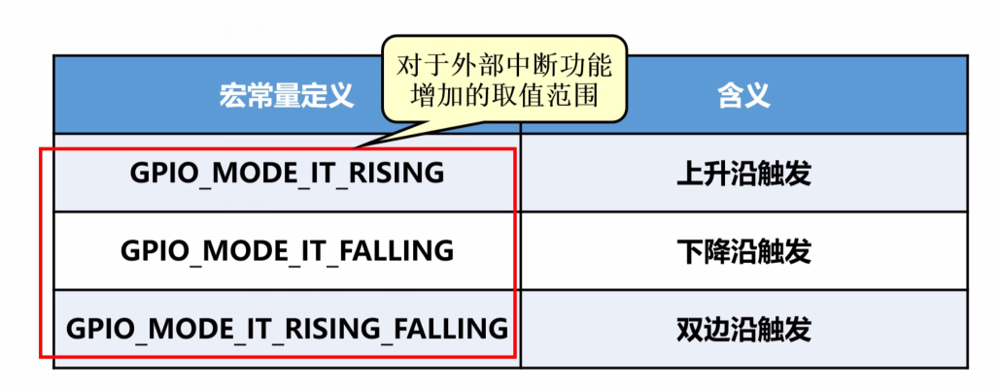
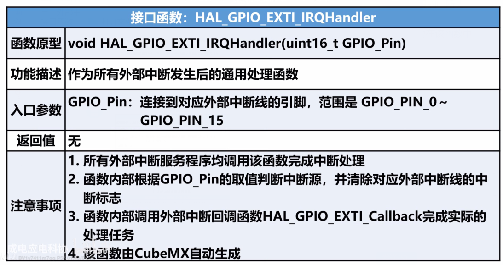
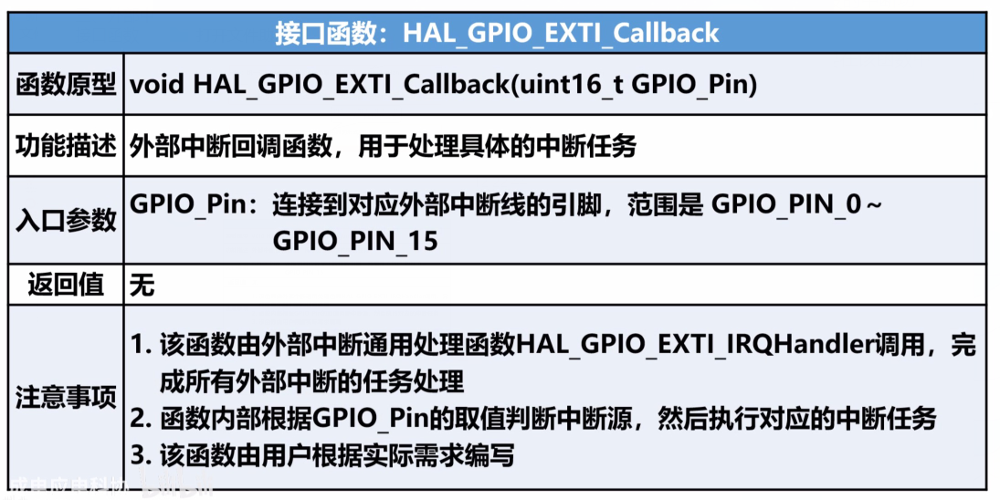

# 中断系统

## 一、中断概述

1. **中断的相关基本概念**

> + 中断的发生：当CPU在处理某一事件A时，发生了另一件事B，请求CPU迅速去处理。
> + 中断处理：CPU暂停当前的工作，转去处理事件B
> + 中断返回：当CPU将事件B处理完毕后，再回到事件A中被暂停的地方继续处理事件A

2. **中断的作用**

> + 速度匹配：可以解决快速的CPU与慢速的外部设备之间传送数据的矛盾
>
> + 分时操作：CPU可以分时为多个外部设备服务，提高计算机的利用率
> + 实时响应：CPU能及时处理应用系统的数据事件，增强系统的实时性。
> + 可靠性强：CPU可以处理设备故障及掉电等突发事件，提高系统可靠性。

3. **中断优先级**

+ 处理器根据不同中断的重要程序设置不同的优先等级，不同优先级中断的处理原则是：高优先级打断第优先级中断；低优先级不可打断高优先级。

+ 中断嵌套

  

+ 中断向量

  1. 中断服务程序

     在响应一个特定中断的时候，处理器会执行一个函数，该函数一般称为中断处理程序或者中断服务程序。

  2. 中断向量和中断向量表

     + 中断向量：中断向量在程序中的入口地址称为中断向量。
     + 中断向量表：在系统中所有的中断向量集中起来放到存储器的某一区域，这个区域叫中断向量表。
     + 中断向量表所在头文件：**star_tup_stm32fxxxx.s**

  3. 查找中断向量的过程

     

  4. 中断响应过程

  

4. **stm32的中断系统**

+ 中断和异常

> 中断：中断时内核外部产生的，一般由硬件引起，比如外设中断和外部中断等
>
> 异常：异常通常是内核自身产生的，大多数是软件引起的，比如除法出错异常，预取值失败等。

+ 中断通道

> 单片机内集成很多外设，对于单个外设而言，他通常具备若干个可以引起中断的中断源，二该外设所有中断源只能通过指定的中断通道向内核申请中断。
>
> 由于中断源数量较多，二中断通道有限，会出现多个中断源共享一个中断通道的情况

+ 中断优先级

> 1. NVIC中有8位中断优先级寄存器NVIC_IPR，理论上可以配置0~255共256级中断
> 2. STM32只使用了其中的高4位，并分成抢占优先级和子优先级两组
> 3. 多个中断同时申请时，先比较抢占优先级，抢占优先级高的先执行，若抢占优先级相同则比较子优先级，若二者都相同，比较中断编号，编号越小，优先级越高。

+ 优先级分组

5. **外部中断控制器**

> + 管理23个外部中断线（EXIT Line）。
> + 0~15号外部中断线用于由GPIO引脚触发的外部中断。
> + 16~22号外部中断线用于RTC闹钟事件，以太网唤醒事件和USB唤醒事件等。
> + 当对应GPIO引脚与外部中断线连接后，GPIO引脚才具备外部中断的功能，可以设置外部中断的触发方式。

6. **外部中断结构**

7. **GPIO中断的触发方式(三种)**

> 1. 上升沿触发
> 2. 下降沿触发
> 3. 双边沿触发

8. **引脚的分组**

> 1. 尾号相同的引脚一组，接入外部中断线
> 2. 同组引脚只能有一个设置为外部中断功能
> 3. EXTI0~EXTI4分别具有独立的中断通道
> 4. EXTI5~EXTI9共享一个中断通道
> 5. EXTI10~EXTI15共享一个中断通道

## 二、HAL库的中断处理流程

1. **HAL库的中断封装**

> 编程步骤

> HAL库对中断的封装处理

> 启动文件：**star_tup_stm32fxxxx.s**

+ 该文件存档在MDK-ARM组中，在该文件中，预先为每个中断编写了一个中断服务程序，只是这些中断服务程序都是死循环，目的只是为了初始化中断向量表；
+ 中断服务程序的属性定义为"weak"，weak属性的函数表示：如果该函数没有在其他文件中定义，则使用该函数；如果用户定义了该函数，则使用用户定义的函数。

> 中断文件：**stm32fxxx_it.c**

+ 该文件存放在User组中，用于存放各个中断的中断服务程序；
+ 在使用CubeMX软件进行初始化配置是，如果使能了某个外设的中断功能，那么在生成代码时，相对应的外设中断服务程序HAL_PPP_IRQHandler就会自动添加到该文件中，用户只需要在该函数中添加相应的中断处理代码即可。

## 三、外部中断的数据类型及接口函数

1. **接口函数**

> 启动文件：**star_tup_stm32fxxxx.s**存放外部中断数据类型
>
> 中断文件：**stm32fxxx_it.c**存放外部中断接口函数

- 引脚初始化数据类型

  

  - Mode

- 外部中断通用处理函数（HAL_GPIO_EXTI_IRQHandler）

- 外部中断回调函数（HAL_GPIO_EXTI_Callback）

2. **外部中断处理流程**

+ 处理流程

+ **外部中断所对应的中断服务程序**

+ **外部中断服务程序**

+ **外部中断回调函数**

+ **补充说明**

+ **流程图**

  

  

 

