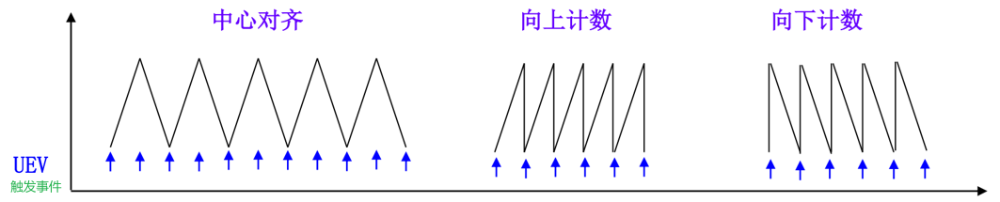

# 第16章、基本定时器


## 一、定时器基本特性

### 1.概述

> 首先说一下什么是定时器，定时器是一种用于定时的外设，有点官方，简单点讲其实就相当于与闹钟，只不过我们所提到的定时器和闹钟又有一些不同，因为这个定时去除了定时的功能以外，他还有其他功能，下面我们会详细的介绍的。

1. **定时器种类**
   1. 基本定时器：只有定时的功能和ADC/DAC触发的功能。
   2. 通用定时器：除了包含基本定时功能外，还有一些其他复用功能。
   3. 高级定时器：比通用定时器的功能更加丰富，这里就行暂时不提，后面17章会讲到。
2. **包含关系**


3. **复用功能**

> 首先，不同芯片中一般都包含了上述三种类型的定时器，但是不太类型的定时器在不同的芯片中的数量是不同的，这得查手册才能知道具体有哪些定时器。但是包含的复用功能一般都如下所示：

:a: 定时

:arrow_backward: ADC和DAC开始转换触发

:a: 输入捕获：脉冲计数、上升沿或下降沿时间检测、PWM输入检测

:arrow_backward: 输出比较：脉冲输出、步进电机控制

:a: 脉冲宽度调节PWM：电压输出控制、直流减速电机控制、直流无刷电机控制

:arrow_backward: 单脉冲模式输出

:a: 编码器接口、霍尔传感器接口

==高级定时器和通用定时器的高级功能是需要配合外部引脚使用的，并且大部分通道所对应的引脚不止一个。==

### 2.时钟树

> 时钟树是非常重要的，是我们后面在计算和配置频率所绕不开的一个话题，但是不同的定时器所对应的时钟频率不一，这我们就得查看数据手册自己去找了。不过定时器一般都是搭载在APB总线上的，外设一般都连在APB总线上。至于是APB1还是APB2，只有查过手册才知道。下图是从`F4`的数据手册中找到的一张图。


==这里要注意一个点，就是定时器模式下的时钟频率和外设时钟频率不一样，一般定时器时钟频率是外设时钟频率的2倍。==


### 3.计数方式

定时器计数方式分为三种：

1. 递增：向上计数
2. 递减：向下计数
3. 递增/递减：中心对齐



4. 计数的区间
   1. 一般情况下，计数的区间为$0$~$2^{16}-1$，具体的计数大小看所选择的芯片编程手册。
5. 通常情况下基本定时器的计数模式为**向上计数**。

==**有的芯片是不存在基本定时器的，只有通用和高级两种定时器**==

## 二、基本定时器原理

### 1.概述

> 基本定时器的功能主要有：
>
> + **基本定时**功能，当累加的时钟脉冲数超过预定值时，能触发中断或者触发DMA请求。
> + 专门用于**驱动数模转换的DAC**

**==这里我以F4芯片中的基本定时器来进行讲解，原理大同小异。==**

### 2.原理


1. **框图讲解**

   1. `时钟源：`

   ​		定时器要实现定时，那么首先需要时钟源，基本定时器的时钟源只能来自**内部时钟**，是由CK_INT提供。定时器的时钟不是直接来自APB1或APB2，而是来自输入为APB1或APB2的一个倍频器。

   ​		当TIM 6和TIM 7的控制寄存器1（ TIMx_CR1 ）的CEN位置1时，内部时钟即向预分频器（功能框图中的第4部分）提供时钟，也就是启动基本定时器。

   2. `触发内部事件：`

   ​		触发控制器是专门用于控制定时器输出一个信号，这个信号可以输出到STM32内部其他外设（作为其他外设的一个输入信号）。基本定时器的触发输出功能专门用于ADC/DAC转换触发启动。

   3. `控制器：`

   ​		定时器控制器，包含有一个触发输出控制器。控制器通过定时器配置寄存器（TIMx_CR）实现对定时器功能配置。控制器实现对定时器的复位、使能以及计数的控制，更简单理解，就是它**控制CK_INT时钟是否可以正常传输到CK_PSC预分频器内。**

   4. `计数器：`

   ​		基本定时器**只能递增**（向上计数），在定时器使能后（CEN置1），计数器COUNTER根据CK_CNT频率向上计数，即每来一个CK_CNT脉冲，TIMx_CNT值就加1，当TIMx_CNT值与TIMx_ARR的设定值相等时就自动生成更新事件（也可以产生DMA请求、产生中断信号或者触发DAC同步电路），并且TIMx_CNT自动清零，然后重新开始计数，不断重复上述过程。因此我们只要设定`TIMx_PSC`和`TIMx_ARR`这两个寄存器的值就可以控制事件生成时间。对应的就是程序中定时器**预分频设置**和**定时器周期**。

   ​		==我们看，这里的ARR和PSC两个寄存器都是存在影子寄存器的，也就是说，他不像其他寄存器一样，修改完后就直接生效，在这里的TIMx_CRx中存在ARPE这一位，用于设置ARR是否立即**生效**，这一位是不影响PSC寄存器的。PSC只有在发送更新事件之后才会进行更新数值。==

---

## 三、Cubemx配置  

**注：我们选择的芯片是`F4IGTx`进行讲解。**

1. 先配置RCC


根据实际情况配置时钟树


2. 配置基本定时器，`按照我的配置来`


3. 使能中断，并配置优先级


4. 保存工程并生成


## 四、代码分析

1. TIM时基配置结构定义

*结构体中的一些变量不一定会用到，也并不是都会有*

```C
/**
  * @brief  TIM时基配置结构定义
  */
typedef struct
{
  uint32_t Prescaler;/* 定时器预分频,设置PSC，取值在0x0000~0xFFFF */
  uint32_t CounterMode;/* 定时器计数方式 */
  uint32_t Period;	/* 定时器周期,设置ARR，取值在0x0000~0xFFFF */
  uint32_t ClockDivision;  /* 时钟分频，基本定时器用不到 */
  uint32_t RepetitionCounter; /* 重复计数器，属于高级定时器的，控制输出的PWM个数 */
  uint32_t AutoReloadPreload; /* 是否预装载ARR */
} TIM_Base_InitTypeDef;
```

2. TIM时基句柄结构定义

```C
/**
  * @brief  TIM时基句柄结构定义
  */
typedef struct
{
  TIM_TypeDef  				*Instance;  /* 寄存器基址 */
  TIM_Base_InitTypeDef 		Init;       /* TIM时基配置结构定义 */
  HAL_TIM_ActiveChannel 	Channel; /* 定时器通道的选择，有四个通道。*/
  DMA_HandleTypeDef 		*hdma[7]; /* 定时器DMA相关。 */
  HAL_LockTypeDef   		Lock;  /* 资源锁机制 */
  __IO HAL_TIM_StateTypeDef State;/* 定时器操作的状态 */
} TIM_HandleTypeDef;
```

3. 初始化

```C
// 初始化定时器
void MX_TIM6_Init(void);
// 初始化参数
HAL_StatusTypeDef HAL_TIM_Base_Init(TIM_HandleTypeDef *htim);
// 设置定时器优先级
void HAL_TIM_Base_MspInit(TIM_HandleTypeDef* tim_baseHandle);
// 禁止中断
void HAL_TIM_Base_MspDeInit(TIM_HandleTypeDef* tim_baseHandle);
```

4. 打开定时器中断

```C
/* Time Base functions ********************************************************/
HAL_StatusTypeDef HAL_TIM_Base_Init(TIM_HandleTypeDef *htim);
HAL_StatusTypeDef HAL_TIM_Base_DeInit(TIM_HandleTypeDef *htim);
void HAL_TIM_Base_MspInit(TIM_HandleTypeDef *htim);
void HAL_TIM_Base_MspDeInit(TIM_HandleTypeDef *htim);
/* Blocking mode: Polling */
HAL_StatusTypeDef HAL_TIM_Base_Start(TIM_HandleTypeDef *htim);
HAL_StatusTypeDef HAL_TIM_Base_Stop(TIM_HandleTypeDef *htim);
/* 打开中断的 */
HAL_StatusTypeDef HAL_TIM_Base_Start_IT(TIM_HandleTypeDef *htim);
HAL_StatusTypeDef HAL_TIM_Base_Stop_IT(TIM_HandleTypeDef *htim);
// 调用
HAL_TIM_Base_Start_IT(htimx);
```

定时器中断时事件更新触发。所以当产生中断时，会进入 `stm32fxxx_it.c`文件找中的 `Timx_XXX_IRQHandler()`函数，这个函数会调用 `HAL_TIM_IRQHandler()`函数。


5. 找到对应的回调函数

```C
/**
  * @brief  非阻塞模式下经过的时间段回调
  * @param  TIM_HandleTypeDef *htim
  * @retval None
  */
__weak void HAL_TIM_PeriodElapsedCallback(TIM_HandleTypeDef *htim)
{
  /* 防止未使用的参数编译警告 */
  UNUSED(htim);
  /* NOTE : 当需要回调时，不修改此函数,只需要在用户文件中定义。 */
}
```

