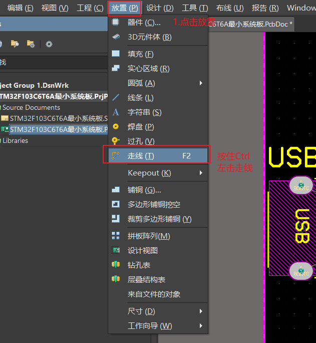

# PCB

## 一、导入

1. 在导入前，可以先点击工具封装管理查看是否都有封装，没有的话也可以直接配置。


2. 导入


3. 由于封装导致的PCB绿色错误


勾选和最小间距设为6 mil


## 二、布局实操

1. 快捷键设置

选择要设置的操作，按住Ctrl后点击鼠标左键进入快捷键设置界面


2. `shift+S`切换层显示模式。
3. `Q`设置mm-mil单位切换

4. `EOS`设置原点
5. 拖动状态下，按`L`切换器件所在的层
6. 推荐设置
7. 设置快捷键`4`，放置电气走线




8. 放置过孔

​		如上面的方法，将数字`5`设置为放置过孔。将数字`6`设置为铺铜。将数字`7`设置为器件在选中的矩形框中摆放。

​		默认的2,3是用于切换视图的。

9. 设置线选和框选

英文状态下，按`S`，如下图：


找到线选，按照设置快捷键的方式，将线选设置为`Ctrl+E`

找到框选，按照设置快捷键的方式，将线选设置为`E`

10. 对齐设置

设置到小键盘上了，4，6，8，2设置对齐方向。水平分布为7，垂直分布为9

11. 设置器件文字的位置

将其设置值为小键盘的1

12. 修改快捷键


| 快捷键 | 功能                     | 快捷键  | 功能               |
| ------ | ------------------------ | ------- | ------------------ |
| 2      | 2D模式                   | Shift+S | 层显示切换         |
| 3      | 3D模式                   | Q       | 单位切换           |
| 4      | 电气走线                 | E O S   | 设置原点           |
| 5      | 过孔                     | L       | 设置器件所在层     |
| 6      | 铺铜                     | A       | 打开对齐菜单       |
| 7      | 选中器件按排列到框选中去 | S       | 打开选择器件的方式 |
| E      | 线选                     |         |                    |
| Ctrl+E | 框选                     |         |                    |

## 三、规则设置

### 1.网络Class设置

1. 创建


2. 创建网络类别


3. 右击就可以添加新类


4. 打开网络


5. 设置网络颜色


设置好颜色后，勾选，就会显示对应颜色

> **打开规则设置**


### 2.间距规则设置


### 3.线宽规则设置

不同信号线的线宽不一样。


1. 电源线


### 4.过孔规则设置

过孔一般都需要用油墨盖住，不盖油的话设置默认，盖油操作


### 5.铺铜规则设置


铺铜操作

选择边框，找到编辑->特殊粘贴，将边框粘贴到Keep-Out层，这样板边就不会铺铜了，防止漏铜。


修改铺铜的层和铺铜方式


设置好上面参数之后，还需要重新灌铜。


## 四、丝印设计

1. 丝印的一般设置值有5-30mil，6-40mil，10-60mil
2. 打开查找相似


3. 设置log

先下载导出log的脚本：

```C
```

点击文件，导入脚本


点击文件，打开脚本


导入后如果太大，可以将log联合后进行缩放


