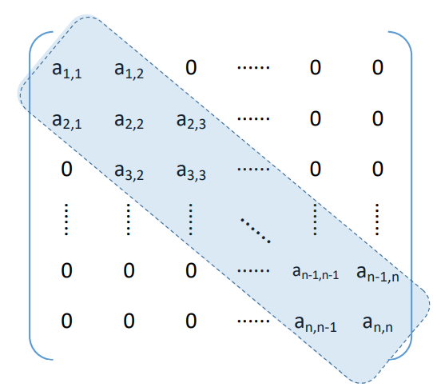
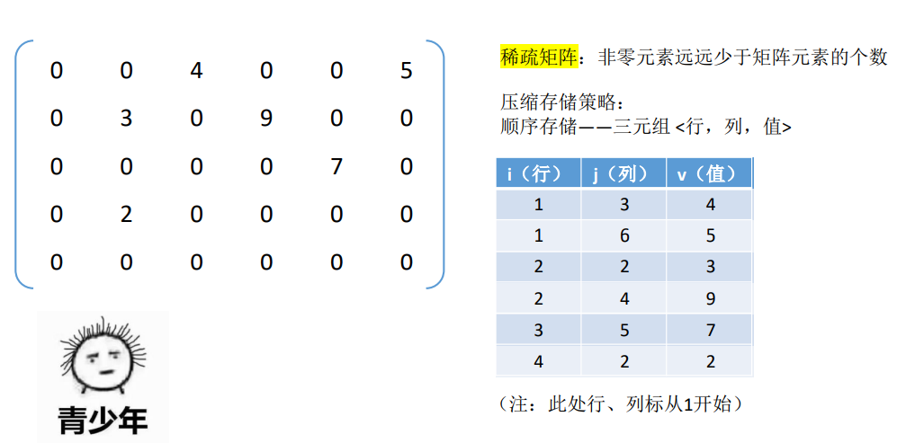
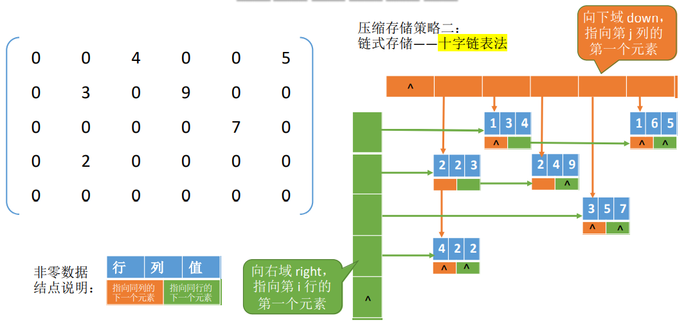

# 第三章、栈和队列

## 一、栈（Stack）的基本概念

**知识总览：**


**栈的定义：**栈（Stack）是只允许*在一端*进行*插入或删除*操作的*线性表*。

**栈顶（Top）：**线性表允许插入删除的一端。

**栈底（Bottom）:**固定的，不允许插入删除的另一端。

**空栈：**不含任何元素的空表。

$\color{red}栈的操作特性为后进先出（Last In First Out ,LIFO）$

*栈的数学性质：n个不同元素进栈，出栈元素不同排序的个数为$\frac{1}{n+1}C^{n}_{2n}$。上述公式称为卡特兰数。*

## 二、顺序栈

**知识总览：**


**顺序栈的定义：**

```C
#define MaxSize 10     // 定义栈中元素的最大个数
typedef struct{
    ElemType data[MaxSize];// 静态数组存放栈中元素
    int top;	// 栈顶指针
}SqStack;
```

*top 指向栈顶元素*

**初始化栈：**

```C
void InitStack(SqStack &S){
    S.top = -1;	// 初始化栈顶指针
}
```

**判空：**

```C
bool StackEmpty(SqStack S) {
    if(S.top == -1)
        return true;
    else
        return false;
}
```

**进栈操作：**

```C
bool Push(SqStack &S,ElemType x) {
    if(S.top > MaxSize-1)
        return false;
    S.data[++S.top] = x;
    return true;
}
```

**出栈操作：**

```C
bool Pop(SqStack &S,ElemType &x) {
    if(S.top == -1)
        return false;
    x = S.data[S.top--];
    return true;
}
```

**读栈顶元素：**

```C
bool GetTop(SqStack S,ElemType &x) {
    if(S.top == -1)
        return false;
    x = S.data[S.top];
    return true;
}
```

$\color{red}顺序栈的缺点： 栈的大小不可变$

**共享栈：**两个栈共享同一片空间


*定义：*

```C
#define MaxSize 10     // 定义栈中元素的最大个数
typedef struct{
    ElemType data[MaxSize];// 静态数组存放栈中元素
    int top0;	// 0号栈顶指针
    int top1;	// 1号栈顶指针
}ShStack;
```

$\color{red}栈满的条件：top0+1 ==top1$


## 三、链栈

**知识总览：**


**链栈的定义：**

```C
typedef struct Linknode{
    ElemType data;// 数据域
    struct Linknode *next;// 指针域
}LinkNode,*LiStack;
```

**初始化栈：**

```C
// 带头结点
void InitStack(LiStack &S){
    S = (LiStack)malloc(sizeof(Linknode));
    S->next = NULL;
}
```

**进栈：**

```C
bool Push(LiStack &S,ElemType x){
    if(S==NULL)
        return false;
    Linknode *p = (Linknode*)malloc(sizeof(Linknode));
    p.data = x;
    p->next = S->next;
    S->next = p;
    return true;
}
```

**出栈：**

```C
bool Pop(LiStack &S,ElemType &x) {
    if(S==NULL)
        return false;
    x = S.data;
    Linknode *p = S;
    S = p->next;
    free(p);
    return true;
}
```

**读取栈顶元素：**

```C
bool GetTop(LiStack &S,ElemType &x) {
    if(S==NULL)
        return false;
    x = S.data;
    return true;
}
```

## 四、队列（Queue）的基本概念

**知识总览：**


**队列的定义：**是只允许*在一端进行插入（入队）*，在*另一端删除出队*的*线性表*。

**队头：**允许删除元素的一端

**队尾：**允许插入元素的一端

**空队列：**不含任何元素的空表

$\color{red}特点：先进先出First In First Out(FIFO)$

## 五、队列的顺序实现

**知识总览：**


**定义：**

```C
#define MaxSize 10
typedef struct{
    ElemType data[MaxSize];
    int front,rear;	// 队头指针和队尾指针
}SqQueue;
```

**初始化：**

```C
void InitQueue(SqQueue &Q) {
    Q.front = Q.rear = 0;
}
```

**判空：**

```C
bool QueueEmpty(SqQueue Q) {
    if(Q.rear == Q.front)
        return true;
    else
    	return false;
}
```

**循环队列—–入队：**

```C
bool EnQueue(SqQueue &Q,ElemType x) {
    // 判断队列是否满
    // 存在弊端的入队，浪费一个存储空间
    if((Q.rear+1)%MaxSize == Q.front)	
        return false;
    Q.data[Q.rear] = x;
    Q.rear = (Q.rear+1)%MaxSize;
    return true;
}
```

**循环队列—–出队：**

```C
bool DeQueue(SqQueue &Q,ElemType &x){
    if(Q.front == Q.rear)
        return false;
    x = Q.data[Q.front];
    Q.front = (Q.front+1)%MaxSize;
    return true;
}
```

**循环队列—–获取值**

```C
bool GetHead(SqQueue Q,ElemType &x){
    if(Q.front == Q.rear)
        return false;
    x = Q.data[Q.front];
    return true;
}
```

$\color{red}注意：队列判断已满/已空$

方案一：会浪费一个空间


方案二：用一个变量记录存入数据的大小。


方案三：用一个变量记录最后一步操作。


## 六、队列链式实现

**知识总览：**


**定义：**

```C
typedef struct LinkNode{
    ElemType data;
    struct LinkNode *next;
}LinkNode;
typedef struct{
    LinkNode *front,*rear;
}LinkQueue;
```

**初始化：**(带头结点)

```C
void InitQueue(LinkQueue &Q){
    Q->front = (LinkNode *)malloc(sizeof(LinkNode));
    Q->rear = Q.front;
    Q->front->next = NULL;
}
```

**判空：**(带头结点)

```C
bool IsEmpty(LinkQueue Q) {
    if(Q->front->next == NULL)
        return true;
    else
        return false;
}
```

**入队：**

```C
// (带头结点)
void EnQueue(LinkQueue &Q,ElemType x) {
    LinkNode* s = (LinkNode *)malloc(sizeof(LinkNode));
    s->data = x;
    s->next = NULL;
    Q.rear->next = s;
    Q.rear = s;
}
// (不带头结点)
void EnQueue(LinkQueue &Q,ElemType x) {
    LinkNode* s = (LinkNode *)malloc(sizeof(LinkNode));
    s->data = x;
    s->next = NULL;
    if(Q.front == NULL) {
        Q.front = s;
        Q.rear = s;
    } else {
        Q.rear->next = s;
        Q.rear = s;
    }
}
```

**出队：**

```C
// 带头结点
bool DeQueue(LinkQueue &Q,ElemType &x) {
    if(Q.front==Q.rear)
        return false;
    LinkNode *p = Q.front->next;
    x = p->data;
    Q.front->next = p->next;
    if(p == Q.rear)
        Q.rear = Q.front;
    free(p);
    return true;
}
// 不带头结点
bool DeQueue(LinkQueue &Q,ElemType &x) {
    if(Q.front == Q.rear)
        return false;
    LinkNode *p = Q.front;
    x = p->data;
    Q.front = p->next;
    if(p == Q.rear){
        Q.front = NULL;
        Q.rear = NULL;
    }
    free(p);
    return true;
}
```

**双端队列：**


## 七、栈的应用

### 1.栈在括号匹配中的应用

*流程：*


**实现：**

*栈的基本操作实现*

```C
typedef struct StackNode{
    char data;
    struct StackNode* next;
}StackNode,*LinkStack;
void InitStack(LinkStack &S) {
    S = NULL;
}
// 判空
bool StackEmpty(LinkStack S){
    if(S == NULL)
        return true;
    else
        return false;
}
// 入栈(无头结点)
bool Push(LinkStack &S,char x) {
    StackNode *p = (StackNode *)malloc(sizeof(StackNode));
    p->data = x;
    p->next = S;
    S = p;
    return true;
}
// 出栈(无头结点)
bool Pop(LinkStack &S,char &x){
    if(S==NULL)
        return false;
    StackNode *p = S;
    x = p->data;
    S = p->next;
    free(p);
    return true;
}
```

*括号匹配实现：*

```C
bool bracketCheck(char str[],int length){
    LinkStack S;
    InitStack(S);
    for(int i = 0;i<length;i++){
        if(str[i]=='('||str[i]=='['||str[i]=='{')
            Push(S,str[i]);
        else{
            if(StackEmpty(S))
                return false;
            char topElem;
            Pop(S,topElem);
            if(str[i]==')'&&topElem!='(')
                return false;
            if(str[i]==']'&&topElem!='[')
                return false;
            if(str[i]=='}'&&topElem!='{')
                return false;
        }  
    }
    return StackEmpty(S);
}
```

### 2.栈在表达式求值中的应用

**知识总览：**


+ 中缀表达式：运算符在两个操作数中间
+ 后缀表达式：运算符在两个操作数后面
+ 前缀表达式：运算符在两个操作数前面

**中缀转后缀的手算方法：** 

> ① 确定中缀表达式中各个运算符的运算顺序 
>
> ② 选择下一个运算符，按照「左操作数 右操作数 运算符」的方式组合成一个新的操作数 
>
> ③ 如果还有运算符没被处理，就继续 ②
>
> *“左优先”原则：只要左边的运算符能先计算，就优先算左边的*

**中缀表达式转后缀表达式（机算）**

> 初始化一个栈，用于保存暂时还不能确定运算顺序的运算符。 从左到右处理各个元素，直到末尾。可能遇到三种情况： 
>
> ① 遇到操作数。直接加入后缀表达式。 
>
> ② 遇到界限符。遇到“(”直接入栈；遇到“)”则依次弹出栈内运算符并加入后缀表达式，直到 弹出“(”为止。注意：“(”不加入后缀表达式。 ③ 遇到运算符。依次弹出栈中优先级高于或等于当前运算符的所有运算符，并加入后缀表达式， 若碰到“(” 或栈空则停止。之后再把当前运算符入栈。

**用栈实现后缀表达式的计算：** 

> ①从左往右扫描下一个元素，直到处理完所有元素 
>
> ②若扫描到操作数则压入栈，并回到①；否则执行③ 
>
> ③若扫描到运算符，则弹出两个栈顶元素，执行相应运算，运算结果压回栈顶，回到①

**中缀转前缀的手算方法：** 

> ① 确定中缀表达式中各个运算符的运算顺序 
>
> ② 选择下一个运算符，按照「运算符 左操作数 右操作数」的方式组合成一个新的操作数 
>
> ③ 如果还有运算符没被处理，就继续 ②
>
> *“右优先”原则：只要右边的运算符能先计算，就优先算右边的*

**中缀表达式的计算（用栈实现）**

> 用栈实现中缀表达式的计算： 
>
> 初始化两个栈，操作数栈和运算符栈 
>
> 若扫描到操作数，压入操作数        栈 
>
> 若扫描到运算符或界限符，则按照“中缀转后缀”相同的逻辑压入运算符栈（期间也会弹出 运算符，每当弹出一个运算符时，就需要再弹出两个操作数栈的栈顶元素并执行相应运算， 运算结果再压回操作数栈）

## 八、矩阵的压缩存储

**总览：**


### 1.对称矩阵


策略：只存储主对角线+下三角区

按行优先原则，$a_{i,j}$是第$\frac{i(i-1)}{2}+j,k=\frac{i(i-1)}{2}+j-1$

按列优先原则，$a_{i,j}$是第$\frac{i(i-1)}{2}+j,k=\frac{i(i-1)}{2}+j-1$

### 2.三角矩阵


按行优先原则，$a_{i,j}$是第$\frac{i(i-1)}{2}+j,k=\begin{cases} \frac{i(i-1)}{2}+j-1 &, i \geq j\\ \frac{n(n+1)}{2} &, i<j\end{cases}$

在最后一个位置存储常 量c


### 3.三对角矩阵




### 4.稀疏矩阵

稀疏矩阵：非零元素远远少于矩阵元素的个数

压缩存储策略：

顺序存储——三元组 <行，列，值>



链式存储——十字链表法




